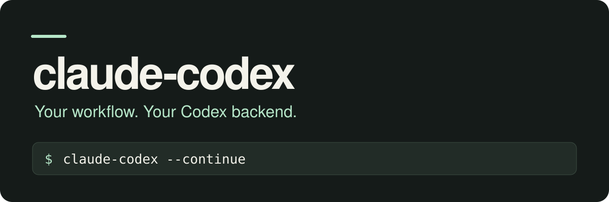

<p align="center">
  
</p>

# claude-codex

**Claude Code, powered by your ChatGPT subscription.**

Keep the Claude Code workflow you already know: its terminal UI, slash commands,
skills, hooks, MCP servers, and tools. `claude-codex` connects it to the Codex
backend using your existing ChatGPT login.

- **A familiar workflow.** Run the regular Claude Code CLI and pass through your usual arguments.
- **Reuse your login.** Load credentials from Codex CLI or OpenCode without an OpenAI API key.
- **Choose your models.** Configure the main model and route auxiliary requests separately, including through Ollama.

## Get started

You need Claude Code, uv,
and a ChatGPT login already configured in Codex CLI or OpenCode.

```bash
git clone https://github.com/azalio/claude-codex.git
cd claude-codex
./install.sh
claude-codex
```

The installer creates the environment and links the launcher into `~/bin`.
Make sure `~/bin` is on your `PATH`, and keep the checkout in place.

## Use it like Claude Code

```bash
# Start a session
claude-codex

# Pick up where you left off
claude-codex --continue

# Ask a question directly
claude-codex -p "Explain this repository"
```

The default is **`gpt-6.1-sol` with `medium` reasoning**.
Choose another model or reasoning level when you launch:

```bash
CLAUDE_CODEX_MODEL=gpt-6.1-sol CLAUDE_CODEX_REASONING=high claude-codex
```

Auto-mode classifier checks use **`codex-auto-review` with `low` reasoning**.
Other auxiliary requests use `gpt-6-luna` with `low` reasoning.
See [model configuration](docs/configuration.md#use) for overrides and Ollama routing.

## How it works

```text
Claude Code → local claude-codex bridge → ChatGPT Codex backend
```

The launcher starts a local proxy, translates Anthropic Messages and streaming
events into the Codex Responses protocol, and runs your installed `claude` binary.
Routing settings apply to that session; your existing configuration files stay intact.

This is an independent bridge using ChatGPT's internal Codex backend.
Subscription limits apply, upstream changes can affect compatibility, and some
Anthropic-specific capabilities are unavailable. Auto-mode checks consume inference
quota. Check the [compatibility matrix](docs/gateway-compatibility.md) for details.

## Go deeper

- [Configuration and usage](docs/configuration.md) — authentication, models, Ollama, TLS, logs, and context recovery.
- [Gateway compatibility](docs/gateway-compatibility.md) — supported features and current limits.
- [Architecture](docs/architecture.md) — how the bridge is built.
- [Local classifier experiments](docs/research/local-ollama-classifiers-2026-10-03.md) — measurements and trade-offs.
