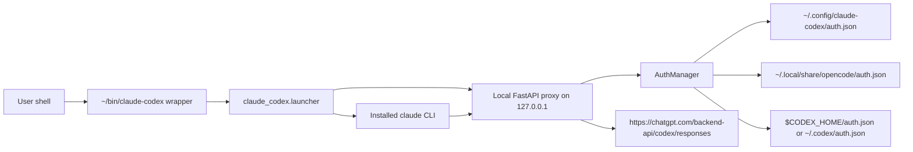

# Architecture

## Overview

`claude-codex` is a local compatibility bridge that lets the normal Claude Code CLI run against a
ChatGPT Codex subscription backend. It starts a local Anthropic-compatible HTTP proxy, points Claude
Code at that proxy through `ANTHROPIC_BASE_URL`, and translates Claude Code's Anthropic Messages
traffic into the Codex Responses protocol.

The project does not replace Claude Code's user interface, tools, slash commands, skills, hooks, or
MCP configuration. Those remain owned by the installed `claude` binary. This repository owns the
local launcher, proxy process, authentication discovery/refresh, and request/stream translation.

## Scope

In scope:

- A `claude-codex` console entrypoint and repo-owned shell wrapper.
- A launcher that starts the proxy on `127.0.0.1`, waits for `/health`, then executes `claude`.
- A FastAPI proxy that implements the Anthropic endpoints used by Claude Code.
- Translation between Anthropic Messages/tool streams and Codex Responses requests/events.
- ChatGPT OAuth credential discovery from explicit cache, OpenCode, or Codex CLI auth files.
- Locked Python environment installation via `uv sync --frozen --reinstall`.
- Unit tests for authentication loading/refresh, proxy streaming, and translation behavior.

Out of scope:

- Public OpenAI Platform API key usage.
- Reimplementing Claude Code's UI, local tools, or MCP runtime.
- A stable public API contract for the upstream ChatGPT Codex backend.
- Multi-user server deployment; the proxy is a local per-session process.

## Quality Goals

- Preserve Claude Code behavior while swapping only the model backend.
- Keep credentials local and avoid mutating OpenCode or Codex credential files.
- Fail quickly when required local executables (`claude`, `uv`) or OAuth credentials are missing.
- Keep translation deterministic and covered by unit tests, especially tool-use loops and streaming.
- Avoid storing upstream Responses data by setting `store: false`.
- Prefer local loopback networking and a per-session proxy lifecycle over a shared long-running daemon.

## System Context

The launcher sets `ANTHROPIC_BASE_URL`, `ANTHROPIC_AUTH_TOKEN`, telemetry/error-reporting disable
flags, and an `X-Session-Id` custom header before invoking `claude`.

## Core Structure

- `src/claude_codex/launcher.py`: finds `claude`, chooses or reads a local port, starts the proxy,
  waits for `/health`, injects Anthropic environment variables, runs Claude Code, and terminates the
  proxy process group on exit.
- `src/claude_codex/proxy.py`: defines the FastAPI app, `/health`, `/v1/messages/count_tokens`, and
  `/v1/messages`; forwards translated requests to the Codex backend through `httpx`.
- `src/claude_codex/translate.py`: lowers Anthropic message payloads into Responses input items,
  converts tool definitions/tool choice, estimates token counts, encodes SSE, and translates
  Responses streaming events back into Anthropic message events.
- `src/claude_codex/auth.py`: loads OAuth tokens from supported local sources, extracts account IDs
  from JWTs, refreshes expired tokens, and saves refreshed credentials to the private project cache.
- `install.sh`: verifies `uv` and `claude`, reinstalls the locked environment from the current repo
  path, and atomically updates the `~/bin/claude-codex` symlink.
- `bin/claude-codex`: repo-owned wrapper that runs `python -m claude_codex.launcher` from `.venv`.
- `tests/`: pytest coverage for translation, proxy streaming, and auth refresh/cache behavior.

## Runtime Flows

### Install

1. `install.sh` resolves the repository directory, `~/bin` target, and repo-owned wrapper.
1. It verifies `uv` and `claude` are available.
1. It runs `uv sync --project "$REPO_DIR" --frozen --reinstall` to rebuild the virtualenv from the
   current path and locked dependencies.
1. It imports `claude_codex` from the new environment as a smoke check.
1. It atomically replaces `~/bin/claude-codex` with a symlink to `bin/claude-codex`.

### Claude Code Session

1. `claude-codex` invokes `claude_codex.launcher`.
1. The launcher finds `claude`, chooses `CLAUDE_CODEX_PORT` or a free loopback port, and starts
   `python -m claude_codex.proxy --port <port>`.
1. The launcher polls `/health` for readiness and then executes `claude` with Anthropic environment
   variables pointing to the local proxy.
1. Claude Code sends Anthropic Messages requests to `/v1/messages`.
1. The proxy loads or refreshes ChatGPT OAuth credentials, derives a stable upstream identity from
   Claude Code's native `anthropic-session-id` header first, then `session-id`, then the launcher
   `x-session-id`, translates the request into a Codex Responses request, and streams upstream
   events from the configured Codex endpoint.
1. `AnthropicStream` translates text and function-call deltas back into Anthropic SSE events.
1. When Claude Code exits, the launcher terminates the proxy process group and closes the proxy log.

### Authentication

Credential loading order is:

1. `CLAUDE_CODEX_AUTH_FILE`
1. `~/.config/claude-codex/auth.json`
1. OpenCode OAuth credentials in `~/.local/share/opencode/auth.json`
1. Codex CLI credentials in `$CODEX_HOME/auth.json` or `~/.codex/auth.json`

OpenCode and Codex credential files are read-only inputs. Refreshed credentials are saved only to
`~/.config/claude-codex/auth.json` with mode `0600`.

## Source of Truth

- `pyproject.toml` defines package metadata, Python version, dependencies, console scripts, pytest
  configuration, and lint rules.
- `uv.lock` pins the resolved Python dependency set used by `install.sh`.
- `README.md` is the user-facing contract for authentication, install, use, and backend caveats.
- `src/claude_codex/*.py` is the runtime implementation.
- `tests/*.py` is the executable specification for supported auth, proxy, and translation behavior.

## Cross-cutting Concepts

- **Anthropic compatibility boundary:** the proxy exposes only the local Anthropic endpoints that the
  Claude Code flow needs and maps them to Responses requests/events.
- **Tool loop translation:** assistant `tool_use` blocks lower to Responses `function_call` items,
  and user `tool_result` blocks lower to `function_call_output` items.
- **Streaming symmetry:** Responses text/function-call deltas are emitted as Anthropic
  `content_block_*`, `message_delta`, and `message_stop` events.
- **Credential locality:** external credential sources are read, while refresh writes are isolated to
  the private `claude-codex` cache.
- **Session isolation:** each launcher run creates a UUID launcher session header and owns its local
  proxy lifecycle, while upstream Codex identity is keyed by `(session_source, session_id)`. Native
  Claude Code session headers take precedence over the launcher fallback so Codex prompt-cache,
  session, thread, and window identifiers stay stable across requests from the same Claude session.
- **Cache-routing telemetry:** proxy request logs include the selected client id, session source,
  and session id so cache-key routing changes can be diagnosed without persisting upstream
  Responses payloads.
- **Installation identity:** the upstream `x-codex-installation-id` is a persistent, proxy-owned
  UUID stored at `~/.config/claude-codex/installation_id`; it is distinct from Codex CLI's own ID.
- **Backend configurability:** `CLAUDE_CODEX_MODEL`, `CLAUDE_CODEX_REASONING`,
  `CLAUDE_CODEX_ENDPOINT`, `CLAUDE_CODEX_PORT`, `CLAUDE_CODEX_AUTH_FILE`,
  `CLAUDE_CODEX_LOG_MAX_BYTES`, `CLAUDE_CODEX_COMPACT_AT`, `CLAUDE_CODEX_REMOTE_COMPACT`, and
  `CLAUDE_CODEX_BIN_DIR` control
  runtime or install behavior.

## Deployment/Operations

This is a local CLI tool, not a service deployment. Operational setup is:

- Clone the repository.
- Run `./install.sh` from the repository root.
- Ensure `~/bin` is on `PATH`.
- Run `claude-codex` with the same arguments normally passed to `claude`.

The launcher writes proxy output to `~/.local/state/claude-codex/proxy.log` and rotates it to one
`proxy.log.1` backup at 10 MiB by default (override with a positive
`CLAUDE_CODEX_LOG_MAX_BYTES` byte value). The proxy listens on loopback only by default. Tests run
with `pytest`; lint rules are configured through Ruff in `pyproject.toml`.

## Known Risks/Gaps

- The upstream Codex endpoint is an internal ChatGPT backend contract and can change without public
  compatibility guarantees.
- Translation support is intentionally narrow and follows the currently tested Claude Code request
  and Responses event shapes.
- Token counting is approximate and based on serialized payload length rather than the upstream model
  tokenizer.
- The launcher requires a working local `claude` executable; there is no fallback CLI.
- The proxy currently retries once on upstream `401`, then surfaces backend failures as HTTP `502`.
- The project has no dedicated integration test that launches the real `claude` binary against a
  live Codex backend.

## ADR Links

No ADR files are present in the repository. Architectural decisions are currently captured in
`README.md`, the runtime modules, and tests.

## Freshness

Last refreshed: 2026-07-16.

Refresh reason: Native Claude Code session identity is now preferred over the launcher fallback for
upstream Codex cache/session routing, and proxy logs expose the selected session source for
diagnostics.

Evidence used for this refresh:

- `README.md`
- `pyproject.toml`
- `install.sh`
- `bin/claude-codex`
- `src/claude_codex/launcher.py`
- `src/claude_codex/proxy.py`
- `src/claude_codex/translate.py`
- `src/claude_codex/auth.py`
- `tests/test_proxy.py`
- `tests/test_translate.py`
- `tests/test_auth.py`
